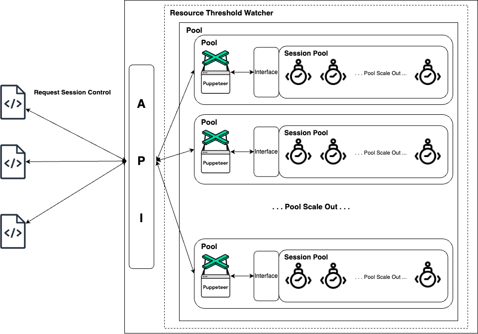

# Puppeteer Pool Manager

<p align="center">
  
</p>

## Puppeteer Pool Manager Config

Default config should be `puppeteer-pool-config.json` in root directory path.

### Default config setting

If config file are not given or invalid path, manager will use default defined configurations. Or if you want to pass config path, you can pass path to `bootPoolManager` function as parameter.

```typescript
{
  "browser_pool": {
    "min": 2,
    "max": 5,
    "width": 1080,
    "height": 1024
  },
  "session_pool": {
    "min": 5,
    "max": 10,
    "width": 1080,
    "height": 1024,
    "ignoreResourceLoad": false,
    "enablePageCache": false
  },
  "threshold": {
    "activate": true,
    "interval": 5,
    "cpu": {
      "break": 10,
      "warn": 5
    },
    "memory": {
      "break": 300,
      "warn": 200
    }
  }
}
```

### `browser_pool`

- `min`: Minimum pool instance
- `max`: Maximum pool instance
- `width`: Browser width. Also set browser width and height if you need some acts like capturing screen or else.
- `height`: Browser height. Also set browser width and height if you need some acts like capturing screen or else.

### `session_pool`

- `min`: Minimum pool instance
- `max`: Maximum pool instance
- `ignoreResourceLoad`: Ignore resource load(This option makes ignore `image`, `stylesheet`, `font` assets request). If you set true, it will ignore resource load. This will increase performance but may occur some unintended behavior.
- `enablePageCache`: Enable page cache. If you set true, it will cache page. This will increase performance but may occur some unintended behavior.

### `threshold`

- `activate`: Activate threshold or not
- `interval`: Interval of checking threshold
- `cpu`
  - `break`: CPU Usage break point. If CPU Usage is over this value, it will log status and reboot session manager puppeteer.
  - `warn`: CPU Usage warning point. If CPU Usage is over this value, it will log status.
- `memory`
  - `break`: Memory Usage break point. If Memory Usage is over this value, it will log and reboot session manager puppeteer.
  - `warn`: Memory Usage warning point. If Memory Usage is over this value, it will log status.

## Puppeteer Pool Manager APIs (`src/pool/manager.ts`)

**This directory will be deploy as single npm package**

### `bootPoolManager(puppeteerOptions,poolConfigPath):Promise<void>`

Boot pool manager. **You need to invoke this function at least once to use another APIs**

#### Parameter

- `puppeteerOptions`
  - `PuppeteerLaunchOptions` from puppeteer([Ref](https://pptr.dev/api/puppeteer.launchoptions))
- `poolConfigPath`
  - `string`
  - Custom Puppeteer Pool config path. Default is project root's `puppeteer-pool-config.json`

### `rebootPoolManager():Promise<void>`

Reboot pool manager. **This api is not recommended to use. Using this API in runtime may occur unintended process break**

### `controlSession(cb):Promise<any>`

Return single session from pool. You need to pass callback function as parameter to use in session. This return result of callback function return value

#### Parameter

- `cb`

  - `sessionCallback`

    ```typescript
    // Session Callback type
    import { Page } from 'puppeteer';

    type sessionCallback = (page: Page) => Promise<any>;
    ```

#### Return Value

- Return callback's return value

### `getPoolMetrics():Promise<PoolMetrics>`

Return pool metrics. This includes pool id, pool CPU Usage, Memory Usage

#### Return Value

```typescript
{
  Id: "ID of pool"
  CPU: "Percentage of CPU that Pool is using (System)",
  Memory: "Memory Usage of Memory that Pool is using. Unit is MB (System)",
  SessionPoolCount: "Session count that Pool is managing"
}

```

## Usage Example

Example of combining pool manager with Express Framework

```typescript
import {
  bootPoolManager,
  controlSession,
  getPoolMetrics,
} from '(Manager Import path)';

async function bootstrap() {
  /**
   * Initialize Express Server
   */

  // Initialize pool
  await bootPoolManager({Puppeteer Launch Options},'Puppeteer Pool Config Path');

  // Control Session example
  server.post('/', async (req, res) => {
    const url = req.body.url;

    // Get single session from pool
    const controlResponse = await controlSession(async (session) => {
      /**
       * Control session here
       */
      return; //(Some values)
    });
    return res.status(200).json({ result: controlResponse });
  });

  server.get('/', async (req, res) => {
    const puppeteerPoolMetrics = await getPoolMetrics();
    return res.status(200).json(puppeteerPoolMetrics);
  });

  /**
   * Some other routers and start server
   */
}
```
